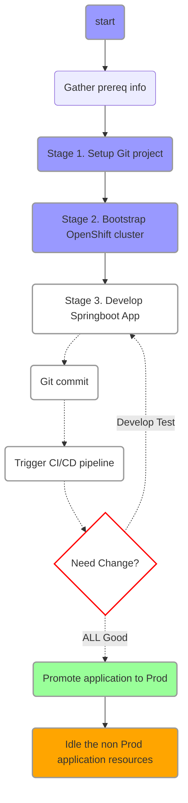
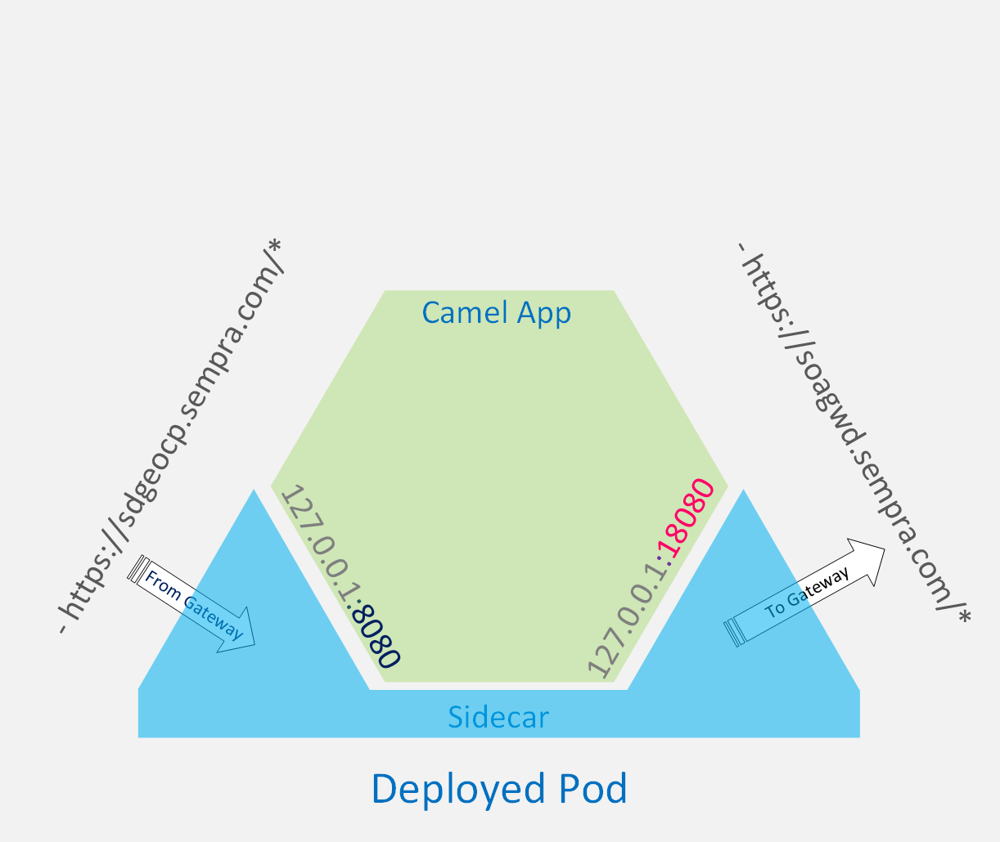
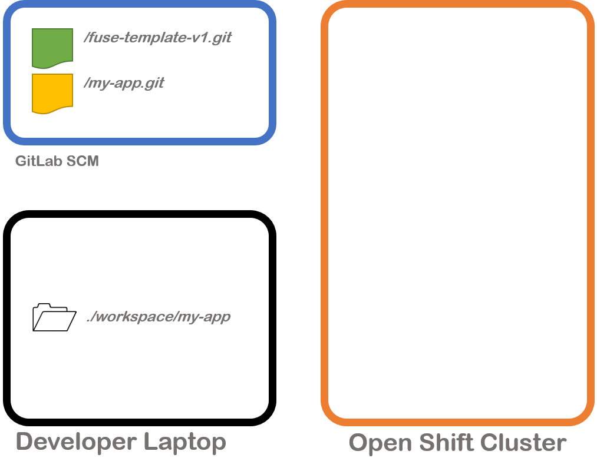
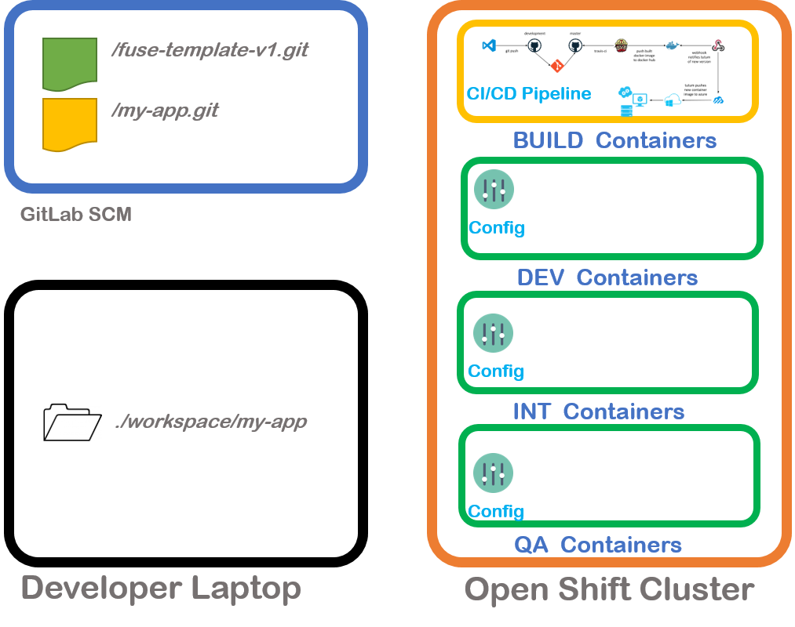
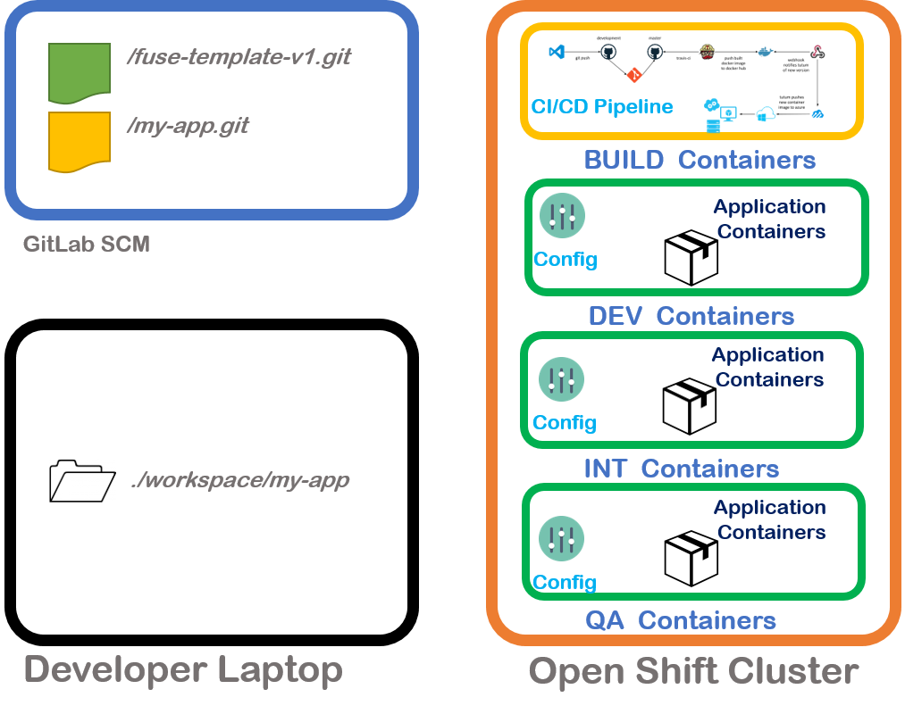

# Open Shift Spring Boot Application template

This project provides a template of resouces and instructions for developing spring boot apps for openshift cluster.

Objectives:

- Setup a Git Repo for application code.
- Setup desktop development environment.
- Create Application deployment configuration which includes prebuild sidecar feature for facilitating secure communications between gateway and appliation instances.
- Create CI pipeline on OpenShift Cluster with preconfigured Jenkins instance.
- Deploy application in the DEV,INT and QA environments using the CICD Pipeline

## 1. Introduction.

### Application development lifecycle



**Fig.1 Application Life cycle**

### Sidecar feature.

The template features the injection of Sidecar into OpenShift deployments for facilitating and securing communications between deployed pods and external entities.In order to leverage the sidecar follow these two rules.

- For **inbound traffic** use http port 8080 for the spring boot app (which is the default).
- For **outbound traffic** to layer7 gateway use the url base `http://localhost:18080/`. The prebuilt sidecar will transparently relay the request to desired Layer 7 API Gateway.



**Fig.2 Side Car**

### Prerequisites

Before you begin ensure following prereqs.

1. **Unix environment** for running shell scripts and commands.Ubuntu for windows is ideal for this. You may be able to install it from YOURCOMPANY Software Center on your laptop
2. **Open Shift CLI binary** You can the `oc` binary from [https://github.com/openshift/origin/releases] and place it somewhere in the \$PATH
   > > oc command autocompletion
   > > Place following command in your ~/.bash_profile

```bash
source <(oc completion bash)
```

3.  **OpenShift Cluster acces** Non Prod cluster is running at `https://master-ocp-d.yourcompany.com:8443`. You can use your yourcompany AD LAN credentials to login here.
4.  **Git CLI** - `git`.

    > > Access to Git Server :https://githost.yourcompany.com. If you are member of SI team you can use your yourcompany AD LAN credentials to login here.

5.  **IDE** An IDE for editing code. Recommended IDEs

- Visual Studio Code
- IntelliJ
- Fuse Eclipese IDE
- Eclipse.

6.  **JDK 1.8** `java` The developer desktop should have JDK version 1.8.
7.  **Apache Maven** - `mvn`
8.  **Ansible** The project setup scripts use ansible tool for scripting repeatable tasks.

#### Project / Resource naming requirements.

Before begining project development choose appropriate names for your project resources as suggested below:

1. **project_name** Consult with your project manager to determine a short, functionally sound and pleasent sounding project name. The project name should be unique . The project name will also be used for the scm/git project name.

- lower case alphabets[a-z] ,numbers[0-9] and [-] admissible.
- For this document assume it to be **ac-dc**

2. **project_display_name** This is human friendly project name. Keep it short and unique.

- For this document assume it to be **XYZ**

## 2. Setup steps.

### Stage 1- Setup Git project

> At the beginning the whole setup should look like this.



**Fig.3 Stage 1**

The first step in any project development should be to create a source repository for your application. Here are the instructions for this:

1. Create a `public` git repo for the project code on gitlab server with your `project_name` e.g. `https://githost.yourcompany.com/group_id/ac-dc`

Create a `ReadMe.md` file in the project repo root with links and details about

- requirements
- design / architecture
- Useful tips and commands

2. Clone the git repo on to a workspace on your computer.

_e.g. on unix shell_

```bash
git clone https://githost.yourcompany.com/group_id/ac-dc  /mnt/c/workspace/ac-dc
```

If you have an existing maven project which you want to use for your application copy the `pom.xml` and the `src` folder from that project to your workspace e.g. to `/mnt/c/workspace/ac-dc` otherwise the project setup belwo will create a demo springboot project for you.

3. Create a `project_config.yaml` file with configuration for Open Shift setup in your project directory. Include below variables.

_e.g. `/mnt/c/workspace/ac-dc/` `project_config.yaml`_

```vi

# Openshift project name prefix
project_name: ac-dc

# Reader friendly display name prefix
project_display_name: Remote Connect

# Domain name suffix for constructing the application urls.
router_dns_suffix: app-ocp-stage.yourcompany.com

# HTTPS url of git repo
git_project_https_url: "https://github.com/ajarv/ac-dc.git"

# sidecar_app_id is used to determine a specific sidecar instance to be
# injected into deployed application.
sidecar_app_id : ccsi
```

4. Initialize your workspace with openshift fuse development template.

_e.g._

```bash
$> cd /mnt/c/workspace/ac-dc
$> bash <(curl -k -s https://raw.githubusercontent.com/ajarv/fuse-template-v2/master/openshift/bin/_install_project_template.sh)

```

5. Checkin your Changes to Git.

_e.g. git checkin command_

```bash
$> git add .
$> git commit -m "Setup the project from template"
$> git push origin master
```

### Stage 2- Bootstrap Open Shift cluster

> At the end of this stage your setup should look like this.



**Fig.4 Stage 1**

In this stage we will prepare the Openshift Cluster to build and Host our application. At the end of this stage your openshift cluster will have one build container project and three Runtime container environments dedicated to your project.

6. Create Openshift Projects and ci pipeline

Log on to Openshift cluster in NON Admin mode i.e. regular user mode.

```bash
$> oc login  -u <Your LAN ID>
$> ./openshift/bin/oc-create-pipeline.sh
```

7. Verify Artifacts on Openshift cluster.

Logon to Openshift web console using your LAN credentials and verify that Openshift projects are created under your name. Also check the build pipeline under the Build project.

```bash
$> oc get projects
```

Verify that the Projects **XYZ Build** , **XYZ Dev** , **XYZ Int** AND **XYZ QA** are present where XYZ is the `project_display_name` parameter

8. Setup GitLab `webhook` for triggering automated builds

The build config for the build pipleline defines a webhook url and secure secret token. These two can be combined to construct a webhook url that can be remotely called via a HTTP request to trigger the Openshift build pipeline.

Use the `oc-get-gitlab-webhook.sh` to view the build webhook url.

```bash
$> ./openshift/bin/oc-get-gitlab-webhook.sh
```

Configure this webhook in your GIT project settings
**Gitlab Console -> Settings -> Integrations**

IMPORTANT: Disable the **Enable SSL verification** checkbox to avoid the issue of GITLAB trying to verify Openshifts certificate because they do not trust each other yet.

### Stage 3 - Develop Springboot App

> At the end of this stage your setup should look like this.



9. If you did not already have a unique name for your maven project edit `pom.xml` with one.
   > TIP - Many IDEs including eclipse IDE do not allow muliple maven projects with same name to be open simultaneously in same IDE workspace

10) Develop / Test / Checkin -- _Repeat_

To test application locally on your laptop/desktop run

```bash
mvn clean package spring-boot:run
```

On OpenShift Web UI Check the status build pipeline under **XYZ Build** project. If you need to restart the build cancel existing build and restart it. you may also use below oc commands to stop/start builds

```bash
oc project ${project_name}-build
#List current builds
oc get builds
>NAME              TYPE              FROM         STATUS    STARTED          DURATION
>snow-pipeline-1   JenkinsPipeline   Git@master   New       32 seconds ago

# Cancel build
oc cancel-build snow-pipeline-1
>build "snow-pipeline-1" cancelled

# Start new build
oc start-build snow-pipeline
>build "snow-pipeline-2" started

# Check status
oc status

```

After the build succeeds you should be able to reach your application via browser at http://${project_name}.${sidecar_app_id}-dev.${router_dns_suffix}/

### Stage 4 - Deleting Openshift Artifacts.

> At the end of this stage your setup should look like this.


To delete project artifacts on OpenShift use the `oc-delete-projects.sh` script

```bash
$> ./openshift/bin/oc-delete-projects.sh
```

### Stage 5 - Save Energy - Idle your application when not in use.

There are idle phases in a application development lifecycle. These are the times when various non-prod application instances and the build pipeline are not under active use.
Openshift provides a way to `idle` the running instances of the application by scaling down the number of application pods to `0`. Openshift automatically rescales the application instances to 1 or more instances when there is active traffic.

To idle the application instances run the following command.

```bash
$> ./openshift/bin/oc-idle-project-resources.sh
```

There is no sideeffect of idling the application except for that it may take a few additional seconds for the application to revive when there fresh requests for idle pods.

### Create Debug builds directly from sources (without Git Checkin)

Sometimes its worthwhile to be able to build and test an app in dev environment without code checkin.
You can use below steps to build and deploy your application to DEV environment.

1. Create debug build

```bash
$> ./openshift/bin/debug/create-debug-project.sh
```

2. Build debug image from local sources

```bash
$> ./openshift/bin/debug/build-debug-image.sh
```

Check for the build status by running `oc get build`

3. Promote debug image to DEV environment

```bash
$> ./openshift/bin/debug/promote-debug-image-to-dev.sh
```
